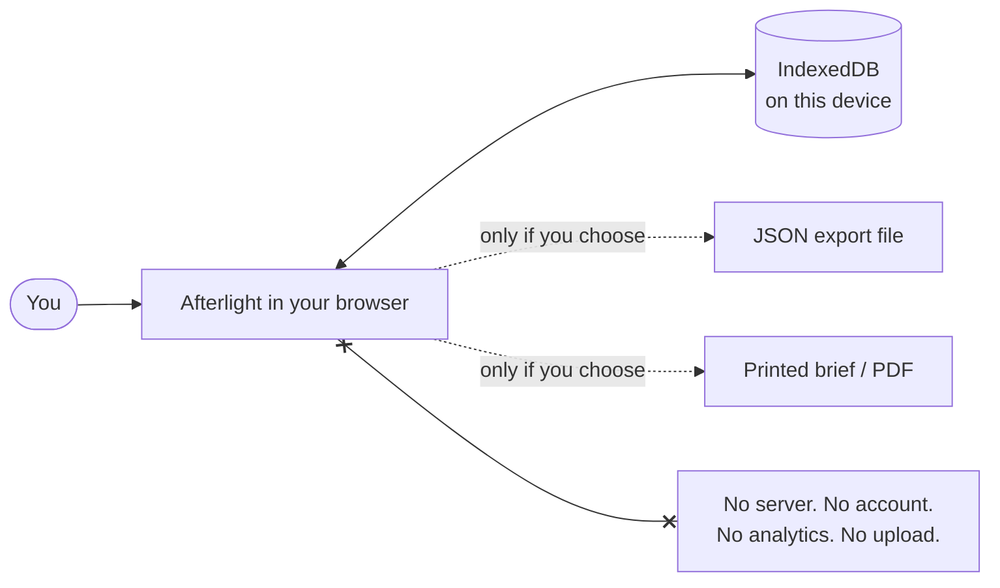

<div align="center">

# Afterlight

**A living record of the sight you fought to keep.**

Your vision changes every day. Your medical record usually doesn't.
Afterlight is a local-first personal eye record that keeps a continuous, day-by-day account
of what *you* see — so nothing depends on what you can remember in a ten-minute appointment.

[](#privacy-by-architecture)
[](#privacy-by-architecture)
[](#technical-notes)
[](#quick-start)
[](LICENSE)

**[Guide](docs/guide.md)** · **[Keeping it safe](docs/keeping-it-safe.md)** ·
**[What it will not do](docs/boundaries.md)** · **[Changelog](CHANGELOG.md)**

</div>

> [!IMPORTANT]
> **The clinical wording has not been reviewed yet.** Everything in Afterlight that describes an eye
> condition, explains a home check, or tells you when to seek urgent care was drafted without
> clinical input and has not yet been reviewed by an ophthalmologist or optometrist. Treat those
> explanations as background reading rather than as advice about your eyes. Your own record — what
> you wrote, when you wrote it — is accurate regardless. See
> [`docs/clinical-review.md`](docs/clinical-review.md); the release script refuses to tag a version
> until this changes.

---

## Why this exists

I had a retinal detachment. I had surgery at nineteen. My vision is still changing.

If you have been through that, you know the specific shape of the problem. The clinic sees you
for fifteen minutes, twice a year. Between those visits, you are the only person watching your
eyes — and by the time you are back in the chair, the questions have collapsed into a single
sentence you don't trust: *"I think it's been a bit worse?"*

You forget which eye. You forget whether the new floater arrived before or after the last
appointment. You cannot describe the shape of the shadow that was so clear at 2am. You are asked
"has it changed since last time?" and you genuinely do not know, because you have nothing to
compare against — your record holds what the *hospital* did to you, not what *you saw*.

That gap is where the fear lives. Not in the diagnosis — in the not-knowing.

Afterlight closes it. Thirty seconds a day, on your own device, builds the thing nobody was
keeping: a continuous, eye-specific, dated account of your own vision. So that when someone asks
what changed, you can answer with a record instead of a guess.

It does not diagnose. It does not reassure. It remembers — accurately, and on your side.

> If you notice sudden floaters, sudden flashes, a curtain or shadow over your vision, or a sudden
> drop in vision: contact an ophthalmologist or emergency eye service now. Log it afterwards.

---

## What it actually does

**The daily loop takes about thirty seconds.**

```
Open  →  "Anything different today?"  →  No  →  logged, done.
                                    →  Yes →  which eye, what, how it compares to your usual
                                              (optionally: draw what you see)  →  logged, done.
```

Everything else is what that daily habit makes possible six months later.

| | |
|---|---|
| **Today** | One question, answered in seconds. "No change" is a real, valuable data point — not an empty day. |
| **What I See** | Draw the floater, the shadow, the distortion, on a visual-field canvas. Overlay any two dates to see the drift you can't hold in your head. |
| **Timeline** | Your entries and your clinical events on one chronology — symptoms, drawings, scans, letters, surgery, medication — never blended, always labelled by source. |
| **My Eyes** | Each eye as its own longitudinal patient: baseline ("what my vision is normally like"), diagnoses, procedures, floaters tracked as persistent objects, measurements, prescriptions. |
| **Imaging & Documents** | Your OCTs, fundus photos, clinic letters and operative notes, in your possession. Compare two OCTs side by side. |
| **Appointments** | The flagship: **Prepare for appointment** turns everything since your last visit into a one-page brief — new / unchanged / improved, per eye — laid out for a sixty-second read. Save it as a real PDF, print it, show it fullscreen in the room, or hand over an encrypted extract covering only the dates you choose. |
| **Visualize** | A 3D anatomy explorer plus schematic explainers for the procedures in *your* record — what a vitrectomy, a buckle, a gas tamponade actually did. Educational, and clearly labelled as generic. |
| **Search & Ask** | `⌘K` searches every record. `?` answers questions from your own history — *"when did glare in my left eye first appear?"* — always with the source, never invented. |

---

## The appointment brief

This is the feature that earns the daily thirty seconds. It reads the period since your last
appointment and writes the summary you would never manage to assemble from memory:

```
RETINA FOLLOW-UP · 9 September 2026
Period: 26 Aug 2026 → 9 Sep 2026

RIGHT EYE (OD)
  UNCHANGED   Floaters — usual strand and dots, unchanged (recorded 6 Sep)
  IMPROVED    Dryness — severity 7/10 → 3/10 since starting artificial tears

LEFT EYE (OS)
  NEW         One new small dark dot, slightly right of centre (first recorded 4 Sep)
  UNCHANGED   Glare — evening glare unchanged (recorded 7 Sep)

VISUAL FIELD HISTORY     [4 Sep]  [7 Sep]  [8 Sep]      ← your own drawings

CLINICAL EVENTS          24 Aug — OCT, left eye
                         26 Aug — Ophthalmology review

QUESTIONS FOR MY DOCTOR  • Is this new floater concerning?
                         • Has my OCT changed since August?
```

Print it, save it as PDF, or present it fullscreen from your phone. It is an *organisational*
summary of what you recorded — deliberately not an interpretation of it.

---

## Principles it refuses to break

**Longitudinal first.** A single reading means little. The change between two dates means
everything. Every screen is built to answer *"compared to when?"*

**Eye-specific by default.** Right eye and left eye are separate stories with separate baselines.
Nothing is ever silently averaged across both.

**Subjective and clinical data never blend.** Every record carries its source — *patient
reported*, *patient drawing*, *clinician documented*, *device measurement*, *extracted from
document* — and wears it as a visible badge. Your drawing of a shadow is never presented as a
retinal image. A clinician's note is never presented as your impression.

**Calm, not alarmist.** No risk scores, no red dashboards, no "your vision is declining"
notifications. When something you log is commonly a reason for urgent assessment, you get one
restrained sentence pointing you at a real doctor — not a probability.

**Missing data is shown as missing.** "Not recorded" is never rendered as a normal result. A
quiet log does not mean a healthy eye, and the app will not imply that it does.

**Patient-owned.** It is your record. Export it whole, take it elsewhere, delete it completely.

---

## Privacy by architecture

Not a policy — a design constraint.



There is no backend. Records, drawings, scans and documents live in IndexedDB in your browser,
on your device. Nothing is transmitted, because there is nowhere for it to be transmitted to.
Your data leaves only when *you* export it or print it.

The trade-off is honest and yours to manage: clearing your browser data deletes your record.
**Export regularly** — Settings → Export everything (JSON) — and keep the file somewhere safe.
That file is your whole eye history; treat it like a medical document, because it is one.

---

## Quick start

```bash
git clone https://github.com/tanueihorng/afterlight.git
cd afterlight/app
npm install
npm run dev          # → http://localhost:5173
```

Then in **Settings → Load demo data** you can explore a full synthetic history — a detachment,
a vitrectomy, OCTs, drawings, a real appointment brief — all clearly badged as demo and removable
in one click, without touching anything of your own.

Build a static copy you can host anywhere (or open offline):

```bash
npm run build        # → app/dist/
npm run build:site   # → site/ — the landing page with the app inside it at /app/
```

The privacy claim is checked against the built files, not just the source:

```bash
npm run nonetwork    # fails on anything a browser would fetch from a third party
```

---

## Technical notes

React 18 · TypeScript · Vite · IndexedDB · Canvas 2D · zero runtime dependencies beyond React.

```
afterlight/
├── EyeExplorer.html          # self-contained 3D eye explorer (Three.js embedded, works offline)
├── docs/eye-explorer.md      # its own documentation
└── app/
    └── src/
        ├── lib/
        │   ├── models.ts     # every record type, each carrying eye + source provenance
        │   ├── db.ts         # IndexedDB persistence, export/import
        │   ├── store.tsx     # single store; the timeline is derived, never stored twice
        │   ├── brief.ts      # the "what changed?" engine behind the appointment brief
        │   ├── search.ts     # global search across every record type
        │   ├── ask.ts        # deterministic Q&A over your own history, with citations
        │   ├── pdf.ts        # a small deterministic PDF writer — same brief, same bytes
        │   ├── share.ts      # encrypted extracts of a chosen date range, never the whole record
        │   ├── qr.ts         # QR encoder, so a summary can be scanned off your screen offline
        │   ├── ingest.ts     # filenames, PDF headers and DICOM read as suggestions, never facts
        │   ├── render.ts     # visual-field drawing renderer
        │   └── education.ts  # generic procedure / condition explainers
        ├── components/       # UI primitives, retina diagram, command palette
        └── pages/            # Today · What I See · Timeline · My Eyes · Imaging · Appointments · Visualize · Settings
```

Two design decisions worth calling out:

- **The timeline is derived, not stored.** Every entity is written once; chronology is computed
  from it. There is no second copy of the truth to drift out of sync.
- **"Ask my records" contains no model.** It is a deterministic query layer over your own data.
  It answers from stored records and cites them, and when it cannot, it says exactly that:
  *"I could not find that in your stored records."* An eye record is not a place to hallucinate.
- **The PDF writer is ours, and it is deterministic.** The same brief always produces byte-identical
  output, so "has this changed?" is answerable by comparing two files — and nothing in the document
  path can reach for a font on someone else's server.

---

## Releasing

`npm run release` runs the whole gate and then **refuses** while
[`docs/clinical-review.md`](docs/clinical-review.md) says the clinical wording is unreviewed. It
does not push and it does not deploy; publishing is a human decision, and the Pages workflow is
`workflow_dispatch` only.

The version stays below `1.0.0` until that review is recorded.

## Where this is going

Afterlight is usable today and still early. The full build plan lives in
**[`docs/plan/`](docs/plan/README.md)** — eleven phases, each a self-contained brief that can be
executed independently: testing foundations, data integrity and portable encrypted archives,
performance at ten years of entries, accessibility built for people who actually have eye disease,
a mobile daily loop, clinical breadth beyond the retina with home self-tests, a photoreal eye
renderer, a whole-eye disease atlas with a "what this looks like from inside" simulator, deeper
record intelligence, clinician handoff, and release with real clinical review.

If you live with a retinal condition and something here is wrong, missing, or worded in a way
that would frighten someone at 2am — [open an issue](https://github.com/tanueihorng/afterlight/issues).
Accessibility barriers and clinical accuracy concerns have their own forms, and both go to a
person. That feedback is worth more than a feature request. Please do not attach your own records;
describe the shape of the problem instead.

Other languages are welcome and the layer for them exists — see
[`docs/translating.md`](docs/translating.md). Only English ships today, and the page is honest about
how much of the app is extracted so far.

---

## Not a medical device

Afterlight is a personal record-keeping tool. It does not diagnose, does not interpret imaging,
does not estimate risk, and does not replace an ophthalmologist. A quiet log is not evidence that
your eyes are fine. If something is sudden or severe, seek urgent assessment — then write it down.

---

<div align="center">

MIT licensed · built by a patient, for patients

*Your vision changes every day. Now your record does too.*

</div>
