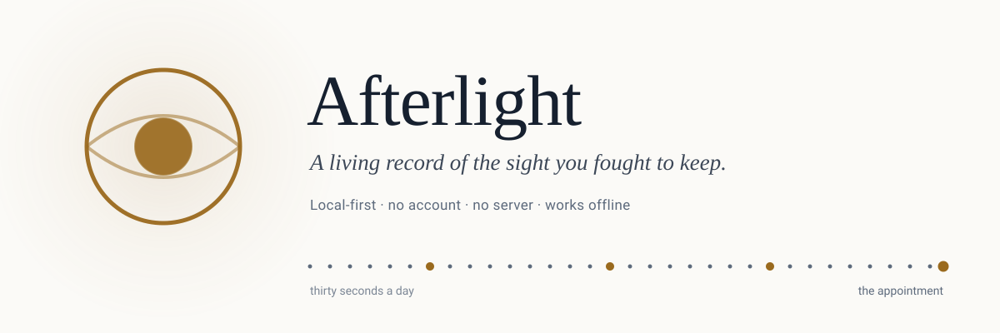
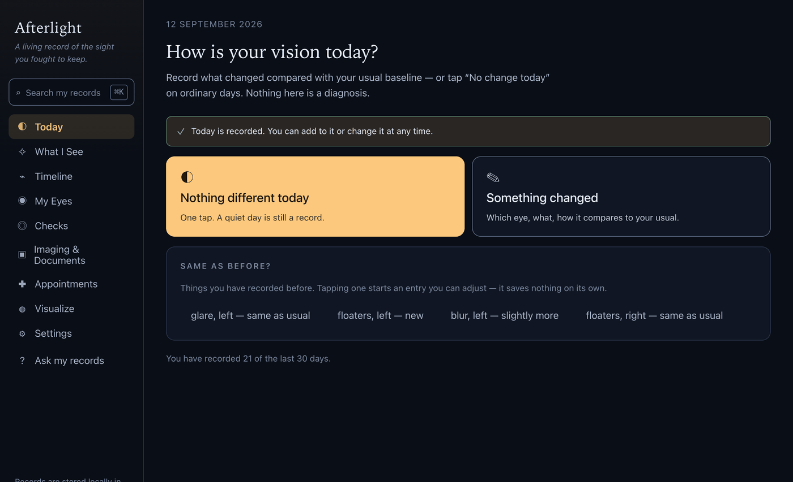
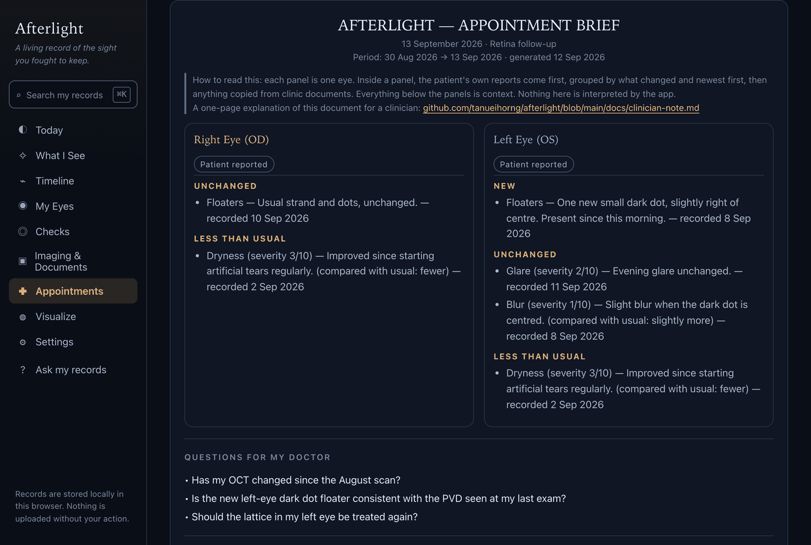
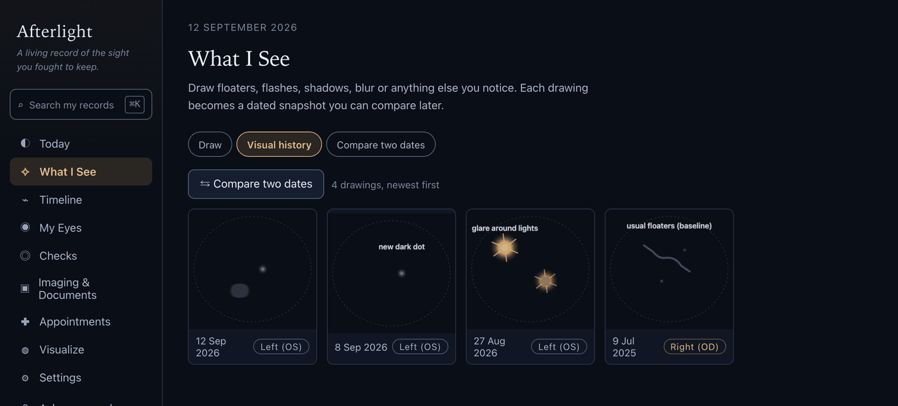
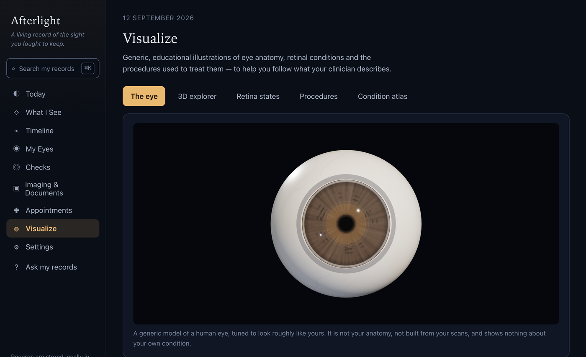
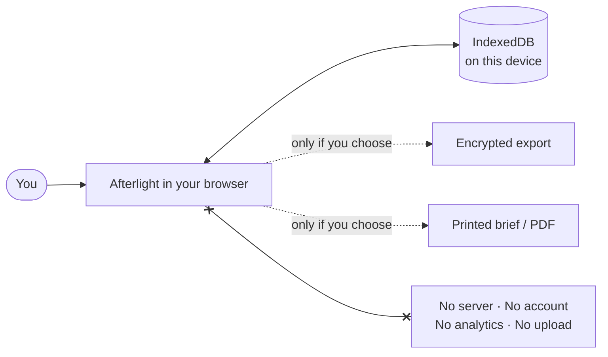

<div align="center">

<picture>
  <source media="(prefers-color-scheme: dark)" srcset="docs/assets/banner-dark.svg">
  <source media="(prefers-color-scheme: light)" srcset="docs/assets/banner-light.svg">
  
</picture>

<br>

Your vision changes every day. Your medical record usually doesn't.<br>
Afterlight keeps a continuous, day-by-day account of what *you* see — so nothing depends on<br>
what you can remember in a ten-minute appointment.

<br>

[](#privacy-by-architecture)
[](#privacy-by-architecture)
[](#quick-start)
[](#quick-start)
[](#the-gate)
[](CHANGELOG.md)
[](LICENSE)

**[Guide](docs/guide.md)** · **[Keeping it safe](docs/keeping-it-safe.md)** ·
**[What it will not do](docs/boundaries.md)** · **[Changelog](CHANGELOG.md)** ·
**[For clinicians](docs/clinician-note.md)**

</div>

> [!IMPORTANT]
> **The clinical wording has not been reviewed yet.** Everything in Afterlight that describes an eye
> condition, explains a home check, or tells you when to seek urgent care was drafted without
> clinical input and has not yet been reviewed by an ophthalmologist or optometrist. Treat those
> explanations as background reading rather than as advice about your eyes. Your own record — what
> you wrote, when you wrote it — is accurate regardless. See
> [`docs/clinical-review.md`](docs/clinical-review.md); the release script refuses to tag a version
> until this changes.

---

## Why this exists

I had a retinal detachment. I had surgery at nineteen. My vision is still changing.

If you have been through that, you know the specific shape of the problem. The clinic sees you
for fifteen minutes, twice a year. Between those visits, you are the only person watching your
eyes — and by the time you are back in the chair, the questions have collapsed into a single
sentence you don't trust: *"I think it's been a bit worse?"*

You forget which eye. You forget whether the new floater arrived before or after the last
appointment. You cannot describe the shape of the shadow that was so clear at 2am. You are asked
"has it changed since last time?" and you genuinely do not know, because you have nothing to
compare against — your record holds what the *hospital* did to you, not what *you saw*.

That gap is where the fear lives. Not in the diagnosis — in the not-knowing.

Afterlight closes it. Thirty seconds a day, on your own device, builds the thing nobody was
keeping: a continuous, eye-specific, dated account of your own vision. So that when someone asks
what changed, you can answer with a record instead of a guess.

It does not diagnose. It does not reassure. It remembers — accurately, and on your side.

> [!WARNING]
> If you notice sudden floaters, sudden flashes, a curtain or shadow over your vision, or a sudden
> drop in vision: contact an ophthalmologist or emergency eye service now. Log it afterwards.

---

## What it looks like

<table>
<tr>
<td width="50%" valign="top">

<b>One question a day</b>



Two targets. "No change" is one tap and a real data point.

</td>
<td width="50%" valign="top">

<b>The brief you hand over</b>



What changed in each eye, and what you wanted to ask. One page.

</td>
</tr>
<tr>
<td width="50%" valign="top">

<b>Draw what you can't describe</b>



Dated snapshots you can lay over each other months later.

</td>
<td width="50%" valign="top">

<b>See what they're describing</b>



A real anatomical model, and fifty conditions — clearly labelled as generic.

</td>
</tr>
</table>

> *Screenshots use the built-in demo record: a synthetic patient with a detachment, a vitrectomy,
> OCTs and six months of entries. Settings → Load demo data, removable in one click.*

---

## The daily loop

```
Open  →  "Anything different today?"  →  No  →  logged, done.
                                    →  Yes →  which eye, what, how it compares to your usual
                                              (optionally: draw what you see)  →  logged, done.
```

Everything else is what that daily habit makes possible six months later.

| | |
|---|---|
| **Today** | One question, answered in seconds. "No change" is a real, valuable data point — not an empty day. |
| **What I See** | Draw the floater, the shadow, the distortion, on a visual-field canvas. Overlay any two dates to see the drift you can't hold in your head. |
| **Timeline** | Your entries and your clinical events on one chronology — symptoms, drawings, scans, letters, surgery, medication — never blended, always labelled by source. |
| **My Eyes** | Each eye as its own longitudinal patient: baseline ("what my vision is normally like"), diagnoses, procedures, floaters tracked as persistent objects, measurements, prescriptions. |
| **Imaging & Documents** | Your OCTs, fundus photos, clinic letters and operative notes, in your possession. Drop a stack in at once; compare two OCTs side by side. |
| **Appointments** | The flagship: **Prepare for appointment** turns everything since your last visit into a one-page brief, laid out for a sixty-second read. Save it as a real PDF, print it, present it fullscreen, or hand over an encrypted extract covering only the dates you choose. |
| **Checks** | An Amsler grid, a card-calibrated vision check and a contrast check — compared only with your own previous attempt, never with a clinic. |
| **Visualize** | A 3D anatomy explorer, fifty conditions with a severity slider, and a "what this looks like from inside" simulator. Educational, and clearly labelled as generic. |
| **Search & Ask** | `⌘K` searches every record. `?` answers questions from your own history — *"when did glare in my left eye first appear?"* — always with the source, never invented. |

<details>
<summary><b>What the appointment brief actually says</b></summary>

<br>

It reads the period since your last appointment and writes the summary you would never manage to
assemble from memory:

```
AFTERLIGHT — APPOINTMENT BRIEF
13 September 2026 · Retina follow-up
Period: 30 Aug 2026 → 13 Sep 2026

RIGHT EYE (OD)            [patient reported]
  UNCHANGED         Floaters — usual strand and dots (recorded 10 Sep)
  LESS THAN USUAL   Dryness 3/10 — improved since starting artificial tears (2 Sep)

LEFT EYE (OS)             [patient reported]
  NEW               One new small dark dot, slightly right of centre (8 Sep)
  UNCHANGED         Glare 2/10 — evening glare unchanged (11 Sep)
  LESS THAN USUAL   Dryness 3/10 (2 Sep)

QUESTIONS FOR MY DOCTOR
  • Has my OCT changed since the August scan?
  • Is the new left-eye dark dot consistent with the PVD seen at my last exam?

WHAT THE PATIENT DREW     [8 Sep]  [11 Sep]  [12 Sep]

FROM CLINIC RECORDS       26 Aug — OCT, left eye
                          30 Aug — Ophthalmology review

Patient-generated record. Not a clinical record, not a measurement, not a diagnosis.
```

Inside each eye, what **you** reported and what you **copied from a clinic letter** are separately
headed and never share a list — blending them is the specific failure this document exists to
prevent.

The PDF writer is ours and it is deterministic: the same brief always produces byte-identical
output, so *"has this changed?"* is answerable by comparing two files. There is a one-page
explanation written for the clinician holding it: [`docs/clinician-note.md`](docs/clinician-note.md).

</details>

---

## Principles it refuses to break

**Longitudinal first.** A single reading means little. The change between two dates means
everything. Every screen is built to answer *"compared to when?"*

**Eye-specific by default.** Right eye and left eye are separate stories with separate baselines.
Nothing is ever silently averaged across both.

**Subjective and clinical data never blend.** Every record carries its source — *patient
reported*, *patient drawing*, *clinician documented*, *device measurement*, *extracted from
document* — and wears it as a visible badge. Your drawing of a shadow is never presented as a
retinal image. A clinician's note is never presented as your impression.

**Calm, not alarmist.** No risk scores, no red dashboards, no "your vision is declining"
notifications. When something you log is commonly a reason for urgent assessment, you get one
restrained sentence pointing you at a real doctor — not a probability.

**Missing data is shown as missing.** "Not recorded" is never rendered as a normal result. A
quiet log does not mean a healthy eye, and the app will not imply that it does.

**Nothing read out of a file is a fact.** A date from a filename, a laterality from `_OD`: all
stored as extracted and unconfirmed, and kept out of your appointment brief until you say so. An
ambiguous date like `04-09-2026` comes back as *both* readings rather than a guess.

**Patient-owned.** It is your record. Export it whole, take it elsewhere, delete it completely.

Each of these is enforced by a check that fails the build, not by good intentions —
see [`npm run guard`](app/scripts/check-invariants.mjs).

---

## Privacy by architecture

Not a policy — a design constraint.



There is no backend. Records, drawings, scans and documents live in IndexedDB in your browser,
on your device. Nothing is transmitted, because there is nowhere for it to be transmitted to.
Your data leaves only when *you* export it, print it, or share a date range you chose.

This is checked rather than claimed: `npm run nonetwork` reads the **built** files and fails on
anything a browser would fetch from a third party — a script, a stylesheet, a font, an image, a
worker, a socket. Verified end to end on the hosted build: **zero external requests**, landing page
through to the daily loop.

> [!CAUTION]
> The trade-off is honest and yours to manage: **clearing your browser data deletes your record**,
> and nobody can restore it for you. Export regularly — Settings → Export everything — and keep the
> file somewhere safe. [How to keep it safe](docs/keeping-it-safe.md) covers backup, restore and
> moving to a new device.

---

## Quick start

```bash
git clone https://github.com/tanueihorng/afterlight.git
cd afterlight/app
npm install
npm run dev          # → http://localhost:5173
```

Then **Settings → Load demo data** gives you a full synthetic history — a detachment, a vitrectomy,
OCTs, drawings, a real appointment brief — all badged as demo and removable in one click, without
touching anything of your own.

```bash
npm run build        # → app/dist/
npm run build:site   # → site/ — the landing page with the app inside it at /app/
npm run nonetwork    # fails on anything a browser would fetch from a third party
```

### The gate

```bash
npm run verify       # types · lint · invariants · changelog · 542 tests · build · budget · network
npm run e2e          # 49 end-to-end, desktop and phone, including offline
```

Nothing is done until both pass clean.

---

<details>
<summary><b>Technical notes</b></summary>


React 18 · TypeScript · Vite · IndexedDB · Canvas 2D · WebGL.
Two runtime dependencies: React and Three.js. Initial download is 81 KB gzipped.

```
afterlight/
├── site/                     # the landing page — static, zero third-party requests
├── EyeExplorer.html          # self-contained 3D eye explorer (Three.js embedded, works offline)
└── app/src/
    ├── lib/
    │   ├── models.ts         # every record type, each carrying eye + source provenance
    │   ├── db.ts             # IndexedDB persistence, export/import, migrations
    │   ├── store.tsx         # single store; the timeline is derived, never stored twice
    │   ├── query.ts          # the one primitive the derived engines share
    │   ├── brief.ts          # the "what changed?" engine behind the appointment brief
    │   ├── trends.ts         # describes numbers; never judges them
    │   ├── search.ts         # global search, clinical synonyms, field scoping
    │   ├── ask.ts            # deterministic Q&A over your own history, with citations
    │   ├── pdf.ts            # a small deterministic PDF writer — same brief, same bytes
    │   ├── qr.ts             # QR encoder, so a summary can be scanned off your screen offline
    │   ├── share.ts          # encrypted extracts of a chosen date range, never the whole record
    │   ├── ingest.ts         # filenames, PDF headers and DICOM read as suggestions, never facts
    │   ├── i18n.ts           # translation lookup; locales/en.ts is the source catalogue
    │   └── render.ts         # visual-field drawing renderer
    ├── engine/               # the eye: real millimetre anatomy, 50 conditions, vision simulator
    ├── components/           # UI primitives, charts, command palette
    └── pages/                # Today · What I See · Timeline · My Eyes · Checks ·
                              # Imaging · Appointments · Visualize · Settings
```

Design decisions worth calling out:

- **The timeline is derived, not stored.** Every entity is written once; chronology is computed
  from it. There is no second copy of the truth to drift out of sync.
- **"Ask my records" contains no model.** It is a deterministic query layer over your own data.
  It answers from stored records and cites them, and when it cannot, it says exactly that:
  *"I could not find that in your stored records."* An eye record is not a place to hallucinate.
- **The PDF and QR writers are ours.** Both are small, both are deterministic, and neither can
  reach for a font or a library on someone else's server. The QR encoder's output was verified
  against an independent decoder, including a byte-exact round trip.
- **A condition is a parameter delta**, not its own artwork — which is what makes severity a slider
  rather than a set of images.
- **The vision simulator never paints field loss black.** It fades. The black-tunnel picture is the
  most misleading image in this subject, and a test enforces its absence.

</details>

<details>
<summary><b>Releasing, and what still needs a human</b></summary>


`npm run release` runs the whole gate and then **refuses** while
[`docs/clinical-review.md`](docs/clinical-review.md) says the clinical wording is unreviewed. It
does not push and it does not deploy; publishing is a human decision, and the Pages workflow is
`workflow_dispatch` with a typed confirmation. The version stays below `1.0.0` until that review is
recorded.

`npm run clinical-pack` generates [`docs/clinical-pack.md`](docs/clinical-pack.md) from the source —
93 strings across the safety wording, every boundary statement, the thirteen condition profiles, all
fifty atlas entries and the home-check instructions, each with the question it needs answering. That
is the document to send a reviewer.

Outstanding, and none of it can be done by software:

- [ ] the clinical review itself;
- [ ] the hosted deploy;
- [ ] the printed brief checked on a real printer, A4 and Letter;
- [ ] a clinician who has never seen the app reading a brief against a clock;
- [ ] the PWA installed on a real iPhone and a real Android handset.

</details>

<details>
<summary><b>How it was built</b></summary>


Eleven self-contained phases, each with its own brief in [`docs/plan/`](docs/plan/README.md) and its
own entry in the [ledger](docs/plan/STATUS.md): testing foundations, data integrity and portable
encrypted archives, performance at ten years of entries, accessibility built for people who actually
have eye disease, a mobile daily loop, clinical breadth beyond the retina with home self-tests, a
photoreal eye renderer, a whole-eye disease atlas with a "what this looks like from inside"
simulator, deeper record intelligence, clinician handoff, and release.

The working agreement for anyone — human or agent — touching this is [`AGENTS.md`](AGENTS.md):
seven non-negotiables, what requires a human, and the definition of done.

</details>

---

## Contributing

If you live with a retinal condition and something here is wrong, missing, or worded in a way that
would frighten someone at 2am — [open an issue](https://github.com/tanueihorng/afterlight/issues).
**Accessibility barriers and clinical accuracy concerns have their own forms, and both go to a
person.** That feedback is worth more than a feature request.

Please do not attach your own records; describe the shape of the problem instead.

Other languages are welcome and the layer for them exists — see
[`docs/translating.md`](docs/translating.md). Only English ships today, and that page is honest
about how much of the app is extracted so far.

[Contributing guide](docs/contributing.md) ·
[Code of conduct](CODE_OF_CONDUCT.md) ·
[Security](SECURITY.md)

---

## Not a medical device

Afterlight is a personal record-keeping tool. It does not diagnose, does not interpret imaging,
does not estimate risk, and does not replace an ophthalmologist. A quiet log is not evidence that
your eyes are fine. If something is sudden or severe, seek urgent assessment — then write it down.

[The boundaries, in full](docs/boundaries.md).

---

<div align="center">

MIT licensed · built by a patient, for patients

*Your vision changes every day. Now your record does too.*

</div>
